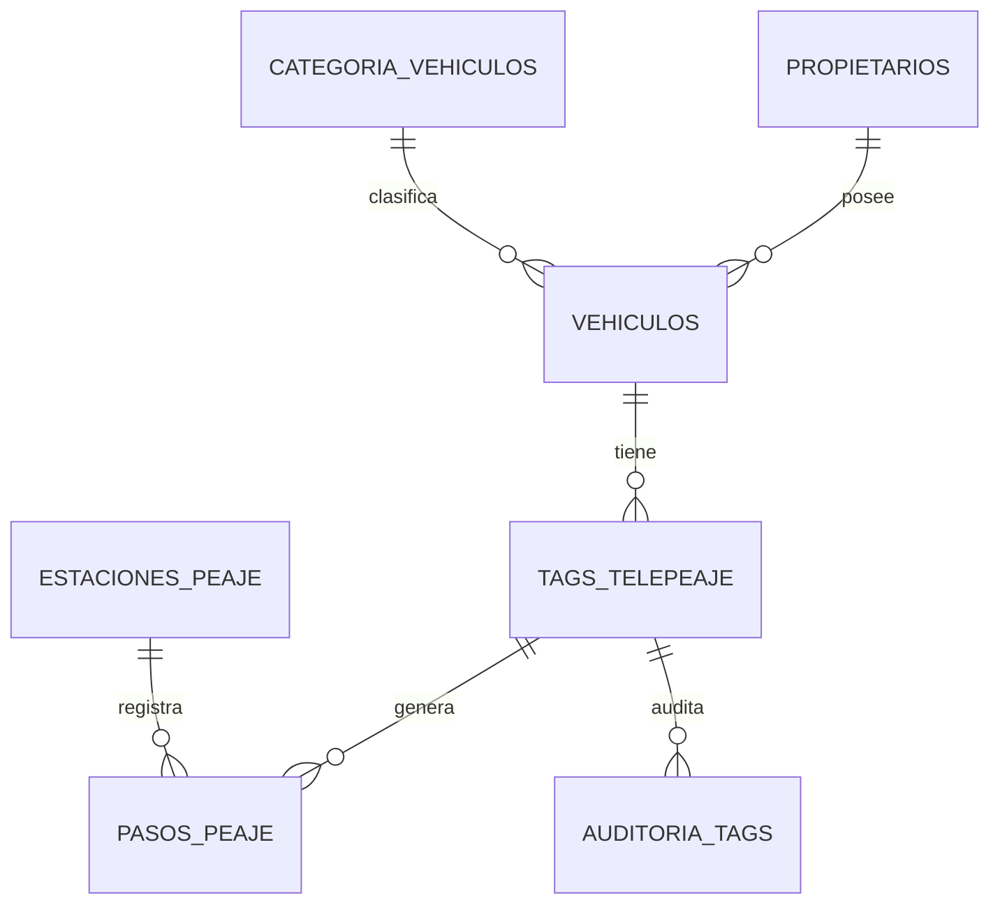

# Informe de avance — Corte 1
## Sistema de Telepeaje y Control de Vehículos (Bases de Datos II)

Este documento resume todo lo que se ha construido y probado para el Corte 1, con el fin de que puedas replicarlo en tu propia máquina y estemos sincronizados antes de la sustentación.

**Estado: los 6 requisitos técnicos del Corte 1 ya fueron creados y probados con éxito en PostgreSQL 16 (Windows, pgAdmin 4).**

---

## 1. Caso de estudio y modelo de datos

**Dominio elegido:** Sistema de Telepeaje y Control de Vehículos.

**7 tablas:**

| Tabla | Rol |
|---|---|
| `Categoria_Vehiculos` | Catálogo (moto, automóvil, camión, etc.) |
| `Estaciones_Peaje` | Catálogo de estaciones |
| `Propietarios` | Datos de personas (documento, correo, teléfono → **datos sensibles**) |
| `Vehiculos` | FK a Propietarios y Categoria_Vehiculos |
| `Tags_Telepeaje` | FK a Vehiculos, tiene `saldo` |
| `Pasos_Peaje` | **Tabla de alto volumen** (60.000 registros), FK a Tags y Estaciones |
| `Auditoria_Tags` | Tabla histórica, FK a Tags, se llena sola por trigger |

**Relaciones:**

(Si no se ve el diagrama, pega este bloque en https://mermaid.live o en VS Code con la extensión Mermaid.)

---

## 2. Instalación de PostgreSQL en Windows (si no lo tienes)

1. Descarga el instalador desde https://www.postgresql.org/download/windows/ (versión 16.x).
2. Ejecútalo dejando todos los componentes por defecto marcados (PostgreSQL Server, pgAdmin 4, Command Line Tools).
3. Define una contraseña para el usuario `postgres` y **anótala**. Deja el puerto en 5432.
4. Al final, cierra/omite Stack Builder (no se necesita para este proyecto).
5. Verifica abriendo "SQL Shell (psql)" desde el menú de inicio: dale Enter a todo hasta que te pida la contraseña. Si ves el prompt `postgres=#`, quedó instalado.

Para trabajar cómodo, usa **pgAdmin 4** (se instala junto con PostgreSQL): ahí abres "Query Tool" contra la base y ejecutas los archivos `.sql`.

---

## 3. Crear la base de datos

En pgAdmin, clic derecho sobre "Databases" → Create → Database, nómbrala `telepeaje_bd2`. (O desde psql: `CREATE DATABASE telepeaje_bd2;`)

---

## 4. Orden de ejecución de los archivos

Ejecuta estos archivos **en este orden exacto**, uno a la vez, con el Query Tool apuntando a `telepeaje_bd2`. Antes de abrir cada archivo nuevo, **borra el contenido del editor** (Ctrl+A, Supr) para no volver a ejecutar el anterior por error.

| # | Archivo | Qué hace |
|---|---|---|
| 1 | `00_ddl_telepeaje.sql` | Crea las 7 tablas con PK, FK, CHECK, UNIQUE |
| 2 | `01_carga_datos_sinteticos.sql` | Carga los datos sintéticos (60.000 en Pasos_Peaje) |
| 3 | `04_funcion_historial_pasos_tag.sql` | Función con `RETURNS TABLE` + manejo de excepciones |
| 4 | `01_sp_recargar_saldo_tag.sql` | Procedimiento con control transaccional + demo de SAVEPOINT |
| 5 | `05_triggers_auditoria_validacion.sql` | Trigger de auditoría + trigger de validación |
| 6-7 | `02_concurrencia_sesion_A.sql` / `03_concurrencia_sesion_B.sql` | Demo de lectura no repetible + deadlock (dos sesiones) |

**Nota:** hay dos archivos con prefijo "01" (`01_carga_datos_sinteticos.sql` y `01_sp_recargar_saldo_tag.sql`) porque se crearon en momentos distintos — guíate por la tabla de arriba, no por el número del nombre.

Verificación después del paso 2:
```sql
SELECT COUNT(*) FROM Pasos_Peaje; -- debe dar 60000
```

---

## 5. Contenido completo de cada script

### 5.1 `00_ddl_telepeaje.sql`
```sql
CREATE TABLE Categoria_Vehiculos (
    id_categoria     SERIAL PRIMARY KEY,
    nombre_categoria VARCHAR(50) NOT NULL UNIQUE,
    tarifa_base      NUMERIC(10,2) NOT NULL CHECK (tarifa_base > 0),
    ejes             SMALLINT NOT NULL CHECK (ejes > 0)
);

CREATE TABLE Estaciones_Peaje (
    id_estacion      SERIAL PRIMARY KEY,
    nombre_estacion  VARCHAR(100) NOT NULL,
    ubicacion_via    VARCHAR(150) NOT NULL,
    carriles_activos SMALLINT NOT NULL CHECK (carriles_activos > 0)
);

CREATE TABLE Propietarios (
    id_propietario   SERIAL PRIMARY KEY,
    documento_id     VARCHAR(20) NOT NULL UNIQUE,
    nombre_completo  VARCHAR(150) NOT NULL,
    correo           VARCHAR(150) UNIQUE,
    telefono         VARCHAR(20),
    fecha_registro   DATE NOT NULL DEFAULT CURRENT_DATE
);

CREATE TABLE Vehiculos (
    placa          VARCHAR(10) PRIMARY KEY,
    id_propietario INT NOT NULL REFERENCES Propietarios(id_propietario),
    id_categoria   INT NOT NULL REFERENCES Categoria_Vehiculos(id_categoria),
    marca          VARCHAR(50) NOT NULL,
    modelo         VARCHAR(50) NOT NULL
);

CREATE TABLE Tags_Telepeaje (
    id_tag          SERIAL PRIMARY KEY,
    codigo_tag_rfid VARCHAR(30) NOT NULL UNIQUE,
    placa_vehiculo  VARCHAR(10) NOT NULL REFERENCES Vehiculos(placa),
    saldo           NUMERIC(10,2) NOT NULL DEFAULT 0 CHECK (saldo >= 0),
    estado          VARCHAR(15) NOT NULL DEFAULT 'ACTIVO'
                     CHECK (estado IN ('ACTIVO', 'BLOQUEADO', 'INACTIVO'))
);

CREATE TABLE Pasos_Peaje (
    id_paso        BIGSERIAL PRIMARY KEY,
    id_tag         INT NOT NULL REFERENCES Tags_Telepeaje(id_tag),
    id_estacion    INT NOT NULL REFERENCES Estaciones_Peaje(id_estacion),
    monto_cobrado  NUMERIC(10,2) NOT NULL CHECK (monto_cobrado > 0),
    fecha_paso     TIMESTAMP NOT NULL DEFAULT now()
);
CREATE INDEX idx_pasos_peaje_id_tag ON Pasos_Peaje(id_tag);

CREATE TABLE Auditoria_Tags (
    id_auditoria      BIGSERIAL PRIMARY KEY,
    id_tag            INT NOT NULL REFERENCES Tags_Telepeaje(id_tag),
    operacion         VARCHAR(10) NOT NULL,
    usuario_bd        VARCHAR(50) NOT NULL,
    fecha_hora        TIMESTAMP NOT NULL DEFAULT now(),
    datos_anteriores  JSONB,
    datos_nuevos      JSONB
);
```

### 5.2 `01_carga_datos_sinteticos.sql`
```sql
INSERT INTO Categoria_Vehiculos (nombre_categoria, tarifa_base, ejes) VALUES
    ('Moto', 2000, 2), ('Automóvil', 8000, 2), ('Camioneta', 10000, 2),
    ('Bus', 15000, 3), ('Camión 2 ejes', 18000, 2), ('Camión 3+ ejes', 25000, 4);

INSERT INTO Estaciones_Peaje (nombre_estacion, ubicacion_via, carriles_activos) VALUES
    ('Peaje Norte', 'Autopista Norte km 12', 4),
    ('Peaje Sur', 'Autopista Sur km 8', 3),
    ('Peaje Occidente', 'Vía al Pacífico km 20', 3),
    ('Peaje Oriente', 'Vía al Llano km 15', 2),
    ('Peaje Centro', 'Autopista Central km 5', 5),
    ('Peaje La Línea', 'Vía La Línea km 30', 2);

INSERT INTO Propietarios (documento_id, nombre_completo, correo, telefono, fecha_registro)
SELECT '10' || lpad(i::text, 8, '0'), 'Propietario ' || i,
       'propietario' || i || '@correo.com',
       '300' || lpad((floor(random() * 9999999))::text, 7, '0'),
       CURRENT_DATE - (floor(random() * 1000))::int
FROM generate_series(1, 2000) AS i;

INSERT INTO Vehiculos (placa, id_propietario, id_categoria, marca, modelo)
SELECT 'VHC' || lpad(i::text, 6, '0'),
       (floor(random() * 2000) + 1)::int,
       (floor(random() * 6) + 1)::int,
       (ARRAY['Toyota','Chevrolet','Renault','Mazda','Kia','Ford'])[floor(random() * 6) + 1],
       (ARRAY['Modelo A','Modelo B','Modelo C','Modelo D'])[floor(random() * 4) + 1]
FROM generate_series(1, 3000) AS i;

INSERT INTO Tags_Telepeaje (codigo_tag_rfid, placa_vehiculo, saldo, estado)
SELECT 'RFID' || lpad(i::text, 8, '0'), 'VHC' || lpad(i::text, 6, '0'),
       (floor(random() * 100000))::numeric / 100,
       (ARRAY['ACTIVO','ACTIVO','ACTIVO','BLOQUEADO','INACTIVO'])[floor(random() * 5) + 1]
FROM generate_series(1, 3000) AS i;

INSERT INTO Pasos_Peaje (id_tag, id_estacion, monto_cobrado, fecha_paso)
SELECT (floor(random() * 3000) + 1)::int,
       (floor(random() * 6) + 1)::int,
       (floor(random() * 23000) + 2000)::numeric,
       now() - (random() * interval '90 days')
FROM generate_series(1, 60000) AS i;
```

### 5.3 `04_funcion_historial_pasos_tag.sql`
```sql
CREATE OR REPLACE FUNCTION fn_historial_pasos_tag(p_id_tag INT)
RETURNS TABLE (
    id_paso INT, nombre_estacion VARCHAR, monto_cobrado NUMERIC, fecha_paso TIMESTAMP
)
LANGUAGE plpgsql
AS $$
BEGIN
    IF NOT EXISTS (SELECT 1 FROM Tags_Telepeaje WHERE id_tag = p_id_tag) THEN
        RAISE EXCEPTION 'No existe un tag con id_tag = %', p_id_tag;
    END IF;

    RETURN QUERY
    SELECT p.id_paso, e.nombre_estacion, p.monto_cobrado, p.fecha_paso
    FROM Pasos_Peaje p
    JOIN Estaciones_Peaje e ON e.id_estacion = p.id_estacion
    WHERE p.id_tag = p_id_tag
    ORDER BY p.fecha_paso DESC;
EXCEPTION
    WHEN OTHERS THEN
        RAISE NOTICE 'Error al consultar historial del tag % -> %', p_id_tag, SQLERRM;
        RAISE;
END;
$$;
-- Prueba: SELECT * FROM fn_historial_pasos_tag(1);
```

### 5.4 `01_sp_recargar_saldo_tag.sql` (procedimiento + SAVEPOINT)
```sql
CREATE OR REPLACE PROCEDURE sp_recargar_saldo_tag(p_id_tag INT, p_monto NUMERIC)
LANGUAGE plpgsql
AS $$
DECLARE
    v_saldo_actual NUMERIC;
BEGIN
    IF p_monto <= 0 THEN
        RAISE EXCEPTION 'El monto de recarga debe ser mayor a 0. Valor recibido: %', p_monto;
    END IF;

    SELECT saldo INTO v_saldo_actual FROM Tags_Telepeaje WHERE id_tag = p_id_tag FOR UPDATE;
    IF NOT FOUND THEN
        RAISE EXCEPTION 'No existe un tag con id_tag = %', p_id_tag;
    END IF;

    UPDATE Tags_Telepeaje SET saldo = saldo + p_monto WHERE id_tag = p_id_tag;
    RAISE NOTICE 'Recarga OK -> tag %, saldo anterior %, saldo nuevo %',
        p_id_tag, v_saldo_actual, v_saldo_actual + p_monto;
EXCEPTION
    WHEN OTHERS THEN
        RAISE NOTICE 'Recarga fallida para tag % -> %', p_id_tag, SQLERRM;
        RAISE;
END;
$$;

-- Transacción con SAVEPOINT y recuperación parcial
-- (correr statement por statement, no todo de un F5, porque el
-- segundo CALL falla a propósito y pgAdmin detiene el script ahí)
BEGIN;
    CALL sp_recargar_saldo_tag(101, 20000);          -- recarga válida
    SAVEPOINT antes_recarga_2;
    CALL sp_recargar_saldo_tag(101, -5000);           -- recarga inválida, dispara error
    ROLLBACK TO SAVEPOINT antes_recarga_2;             -- ejecutar DESPUÉS del error
COMMIT;
```

### 5.5 `05_triggers_auditoria_validacion.sql`
```sql
CREATE OR REPLACE FUNCTION fn_auditoria_tags()
RETURNS TRIGGER LANGUAGE plpgsql AS $$
BEGIN
    INSERT INTO Auditoria_Tags (id_tag, operacion, usuario_bd, fecha_hora, datos_anteriores, datos_nuevos)
    VALUES (OLD.id_tag, 'UPDATE', current_user, now(), to_jsonb(OLD), to_jsonb(NEW));
    RETURN NEW;
END;
$$;

CREATE TRIGGER trg_auditoria_tags
AFTER UPDATE ON Tags_Telepeaje
FOR EACH ROW EXECUTE FUNCTION fn_auditoria_tags();

CREATE OR REPLACE FUNCTION fn_validar_saldo_tag()
RETURNS TRIGGER LANGUAGE plpgsql AS $$
BEGIN
    IF NEW.saldo < 0 THEN
        RAISE EXCEPTION 'El saldo del tag % no puede ser negativo (valor recibido: %)', NEW.id_tag, NEW.saldo;
    END IF;
    RETURN NEW;
END;
$$;

CREATE TRIGGER trg_validar_saldo_tag
BEFORE INSERT OR UPDATE ON Tags_Telepeaje
FOR EACH ROW EXECUTE FUNCTION fn_validar_saldo_tag();
```

### 5.6 Concurrencia — Sesión A (`02_concurrencia_sesion_A.sql`)
```sql
-- PARTE A: Lectura no repetible
BEGIN TRANSACTION ISOLATION LEVEL READ COMMITTED;
SELECT id_tag, saldo FROM Tags_Telepeaje WHERE id_tag = 101;   -- primera lectura
-- >>> pausa: ve a Sesión B y corre su PARTE A completa
SELECT id_tag, saldo FROM Tags_Telepeaje WHERE id_tag = 101;   -- segunda lectura (distinta)
COMMIT;

-- PREPARACIÓN (una sola vez, en cualquiera de las dos sesiones,
-- antes de la Parte B — evita que el CHECK de saldo>=0 dañe la demo)
UPDATE Tags_Telepeaje SET saldo = 50000 WHERE id_tag IN (101, 102);

-- PARTE B: Deadlock
BEGIN;
UPDATE Tags_Telepeaje SET saldo = saldo - 1000 WHERE id_tag = 101;
-- >>> pausa: ve a Sesión B y corre su primer UPDATE (tag 102)
UPDATE Tags_Telepeaje SET saldo = saldo + 1000 WHERE id_tag = 102;  -- queda esperando
COMMIT; -- o ROLLBACK si esta sesión fue la abortada
```

### 5.7 Concurrencia — Sesión B (`03_concurrencia_sesion_B.sql`)
```sql
-- PARTE A
BEGIN;
UPDATE Tags_Telepeaje SET saldo = saldo + 10000 WHERE id_tag = 101;
COMMIT;
-- >>> vuelve a Sesión A y corre su segunda lectura

-- PARTE B (ejecutar DESPUÉS de que Sesión A bloqueó el tag 101)
BEGIN;
UPDATE Tags_Telepeaje SET saldo = saldo - 1000 WHERE id_tag = 102;
-- >>> pausa hasta que Sesión A corra su segundo UPDATE
UPDATE Tags_Telepeaje SET saldo = saldo + 1000 WHERE id_tag = 101;  -- dispara el deadlock
COMMIT; -- o ROLLBACK si esta sesión fue la abortada
```

---

## 6. Errores que nos salieron y cómo se resolvieron

Por si te pasa lo mismo al probar tú:

1. **`la relación «categoria_vehiculos» ya existe` (SQL state 42P07)** al correr la carga: pasa si el editor de pgAdmin todavía tiene el DDL pegado de antes y se ejecuta de nuevo junto con la carga. Solución: borrar el editor (Ctrl+A, Supr) antes de abrir cada archivo nuevo.

2. **Error al llegar al `CALL sp_recargar_saldo_tag(101, -5000)`** dentro del bloque de SAVEPOINT: es el comportamiento esperado (la excepción se dispara a propósito). El problema es que **pgAdmin detiene el script completo ahí** y no corre las líneas siguientes solo. Hay que ejecutar `ROLLBACK TO SAVEPOINT antes_recarga_2;` y `COMMIT;` manualmente después del error, no de un solo F5.

3. **`viola la restricción «check» «tags_telepeaje_saldo_check»`** al probar el deadlock con los tags 101/102: pasa si a alguno de esos tags le tocó, por los datos aleatorios, un saldo menor a 1000 — restarle 1000 lo manda a negativo y el CHECK lo bloquea (correctamente). Solución: correr primero `UPDATE Tags_Telepeaje SET saldo = 50000 WHERE id_tag IN (101, 102);` antes de intentar el deadlock (ya está incluido como paso de "PREPARACIÓN" arriba).

4. **Cada sesión que se queda en error queda "abortada"**: cualquier `SELECT` posterior da `current transaction is aborted...` hasta que se corra `ROLLBACK;` (o `ROLLBACK TO SAVEPOINT`, si aplica) en esa misma pestaña.

---

## 7. Checklist de lo ya probado con éxito

- [x] DDL: 7 tablas creadas con PK/FK/CHECK/UNIQUE
- [x] Carga: 60.000 registros en `Pasos_Peaje` (> 50.000 exigidos)
- [x] Función `fn_historial_pasos_tag` con RETURNS TABLE + excepción probada
- [x] Procedimiento `sp_recargar_saldo_tag` con control transaccional
- [x] Transacción con SAVEPOINT y recuperación parcial (saldo final correcto)
- [x] Trigger de validación (bloqueó un saldo negativo) y trigger de auditoría (quedó registrado en `Auditoria_Tags`)
- [x] Lectura no repetible entre dos sesiones (READ COMMITTED)
- [x] Deadlock provocado entre dos sesiones (Postgres lo detectó solo, `SQL state 40P01`)

## 8. Pendiente antes de la sustentación

- [ ] Que ambos integrantes ensayen TODO el flujo (no solo su parte), porque el docente puede preguntarle a cualquiera sobre cualquier sección.
- [ ] Cronometrar el guion completo para que quepa en 10-15 minutos.
- [ ] Llevar los 7 archivos `.sql` organizados como entregable.
